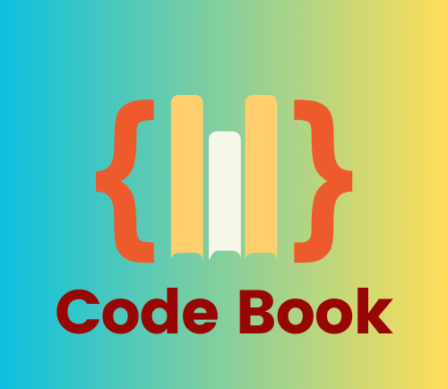

# 🚀 CodeBook - A Modern Online Code Editor  



**CodeBook** is a powerful, browser-based **code editor** built with **React**, featuring **Judge0 API** integration for real-time compilation. With support for multiple programming languages, file management, and theme switching, CodeBook is your go-to online coding environment!  

---


## ✨ Features  

✅ **Multi-language Support**: Write & execute **C++**, **Python**, **Java**, and **JavaScript** code.  
✅ **Folder & File Management**: Organize projects by creating folders and files.  
✅ **Import & Export**: Save and restore your code & input/output data.  
✅ **🌙 Dark Mode / ☀️ Light Mode**: Switch between themes for better visibility.  
✅ **⚡ Real-time Compilation**: Uses **Judge0 API** to run code instantly.  
✅ **💾 Data Persistence**: Saves projects in **localStorage** for easy access.  

---

## 🛠️ Supported Languages  

📌 **C++**  
📌 **Python**  
📌 **Java**  
📌 **JavaScript**  

---


 **Clone the Repository:**  

```bash
git clone https://github.com/Aman041902/CodeBook.git
cd code_editor
